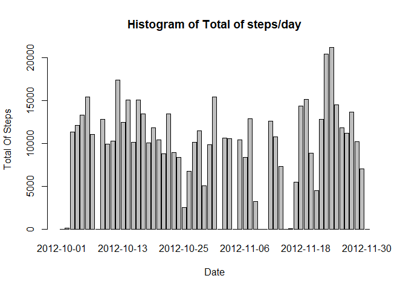
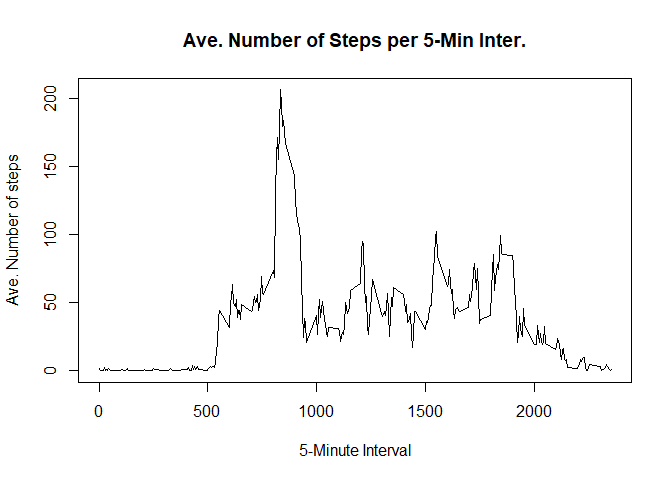
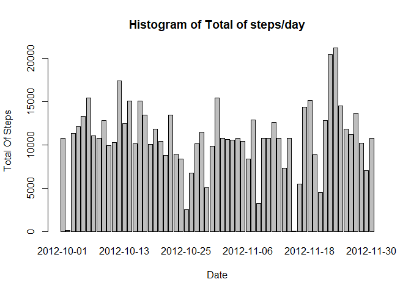
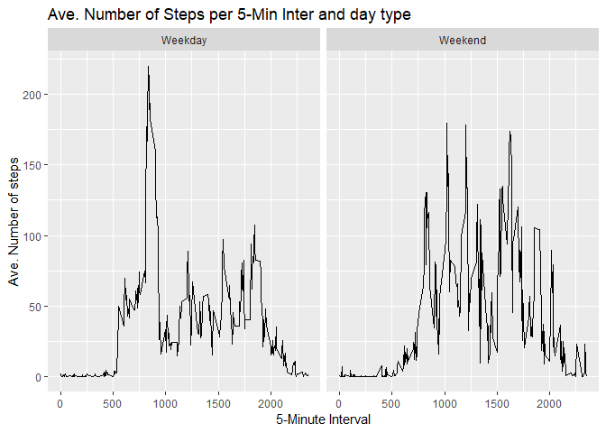

## Introduction

It is now possible to collect a large amount of data about personal movement using activity monitoring devices such as a Fitbit, Nike Fuelband, or Jawbone Up. These type of devices are part of the "quantified self" movement - a group of enthusiasts who take measurements about themselves regularly to improve their health, to find patterns in their behavior, or because they are tech geeks. But these data remain under-utilized both because the raw data are hard to obtain and there is a lack of statistical methods and software for processing and interpreting the data.

This assignment makes use of data from a personal activity monitoring device. This device collects data at 5 minute intervals through out the day. The data consists of two months of data from an anonymous individual collected during the months of October and November, 2012 and include the number of steps taken in 5 minute intervals each day.

### Required Packages


```r
library(plyr)
library(ggplot2)
```

### Code for reading in the dataset and/or processing the data


```r
data <- read.csv("activity.csv")
data$date <- as.Date(as.character(data$date), "%Y-%m-%d")
head(data)
```

```
##   steps       date interval
## 1    NA 2012-10-01        0
## 2    NA 2012-10-01        5
## 3    NA 2012-10-01       10
## 4    NA 2012-10-01       15
## 5    NA 2012-10-01       20
## 6    NA 2012-10-01       25
```

### Total of steps per day Matrix


```r
StepsPerDayMatrix <- ddply(data, .(date), function(x) sum(x$steps, na.rm = TRUE))
colnames(StepsPerDayMatrix)[2]<- "Total.Steps"
head(StepsPerDayMatrix)
```

```
##         date Total.Steps
## 1 2012-10-01           0
## 2 2012-10-02         126
## 3 2012-10-03       11352
## 4 2012-10-04       12116
## 5 2012-10-05       13294
## 6 2012-10-06       15420
```

### Formatting correctly the date column


```r
StepsPerDayMatrix$date <- as.Date(as.character(StepsPerDayMatrix$date), "%Y-%m-%d")
```

### Histogram of the total number of steps taken each day


```r
with(StepsPerDayMatrix, barplot(Total.Steps, names.arg = date,
                                xlab = "Date", 
                                ylab = "Total Of Steps", 
                                main = "Histogram of Total of steps/day"))
```

<!-- -->

### Calculating and reporting the mean and median of Total.Steps


```r
mean(StepsPerDayMatrix$Total.Steps, na.rm = TRUE)
```

```
## [1] 9354.23
```

```r
median(StepsPerDayMatrix$Total.Steps, na.rm = TRUE)
```

```
## [1] 10395
```

### Mean of steps per 5-minute interval


```r
StepsPerMinInter <- tapply(data$steps, data$interval, mean, na.rm = TRUE) # used later
StepsPerMinInterMatrix <- ddply(data, .(interval), function(x) mean(x$steps, na.rm = TRUE))
colnames(StepsPerMinInterMatrix)[2]<- "Mean"
head(StepsPerMinInterMatrix)
```

```
##   interval      Mean
## 1        0 1.7169811
## 2        5 0.3396226
## 3       10 0.1320755
## 4       15 0.1509434
## 5       20 0.0754717
## 6       25 2.0943396
```

### Plot of  the 5-minute interval (x-axis) and the average number of steps taken across all days (y-axis)


```r
plot(StepsPerMinInterMatrix$interval,
     StepsPerMinInterMatrix$Mean,
     type="l",
     xlab="5-Minute Interval",
     ylab="Ave. Number of steps",
     main = "Ave. Number of Steps per 5-Min Inter."
)
```

<!-- -->

### The 5-minute interval containing the maximum average number of steps


```r
MaxMeanPerMinInter <- max(StepsPerMinInterMatrix$Mean)
StepsPerMinInterMatrix[StepsPerMinInterMatrix$Mean == MaxMeanPerMinInter, 1]
```

```
## [1] 835
```

### Number of NA's


```r
sum(is.na(data))
```

```
## [1] 2304
```

### Filling in the NA's with the mean of steps for each 5-min interval


```r
NAIndexes <- which(is.na(data$steps))
for (i in NAIndexes) {
    
      data[i,1] <- StepsPerMinInter[[as.character(data[i,3])]]
}
head(data)
```

```
##       steps       date interval
## 1 1.7169811 2012-10-01        0
## 2 0.3396226 2012-10-01        5
## 3 0.1320755 2012-10-01       10
## 4 0.1509434 2012-10-01       15
## 5 0.0754717 2012-10-01       20
## 6 2.0943396 2012-10-01       25
```

### Histogram of the total number of steps taken each day (after updating the matrix "StepsPerDayMatrix")


```r
with(StepsPerDayMatrix, barplot(Total.Steps, names.arg = date,
                                xlab = "Date", 
                                ylab = "Total Of Steps", 
                                main = "Histogram of Total of steps/day"))
```

<!-- -->

### Calculating and reporting the new mean and median of Total.Steps


```r
mean(StepsPerDayMatrix$Total.Steps, na.rm = TRUE)
```

```
## [1] 10766.19
```

```r
median(StepsPerDayMatrix$Total.Steps, na.rm = TRUE)
```

```
## [1] 10766.19
```

- We see that those values are different than the previous ones. So we can say that missing values can derail our analysis.


### Adding a new column "day.type" to the dataset


```r
data$day.type <- ifelse(weekdays(as.POSIXct(data$date)) == "Sunday", "Weekend", "Weekday")
data$day.type <- as.factor(data$day.type)
head(data)
```

```
##       steps       date interval day.type
## 1 1.7169811 2012-10-01        0  Weekday
## 2 0.3396226 2012-10-01        5  Weekday
## 3 0.1320755 2012-10-01       10  Weekday
## 4 0.1509434 2012-10-01       15  Weekday
## 5 0.0754717 2012-10-01       20  Weekday
## 6 2.0943396 2012-10-01       25  Weekday
```

### Mean of steps per 5-minute interval and day type


```r
StepsPerMinInterDT <- ddply(data, .(interval, day.type), function(x) mean(x$steps))
colnames(StepsPerMinInterDT)[3]<- "Mean"
head(StepsPerMinInterDT)
```

```
##   interval day.type       Mean
## 1        0  Weekday 1.94375222
## 2        0  Weekend 0.21462264
## 3        5  Weekday 0.38447846
## 4        5  Weekend 0.04245283
## 5       10  Weekday 0.14951940
## 6       10  Weekend 0.01650943
```

### Plot of  the 5-minute interval (x-axis) and the average number of steps taken across  all weekday days or weekend days (y-axis)


```r
qplot(interval, Mean, data = StepsPerMinInterDT, facets = .~ day.type, geom = "line") +
  ggtitle("Ave. Number of Steps per 5-Min Inter and day type") + xlab("5-Minute Interval") +
  ylab("Ave. Number of steps")
```

<!-- -->

